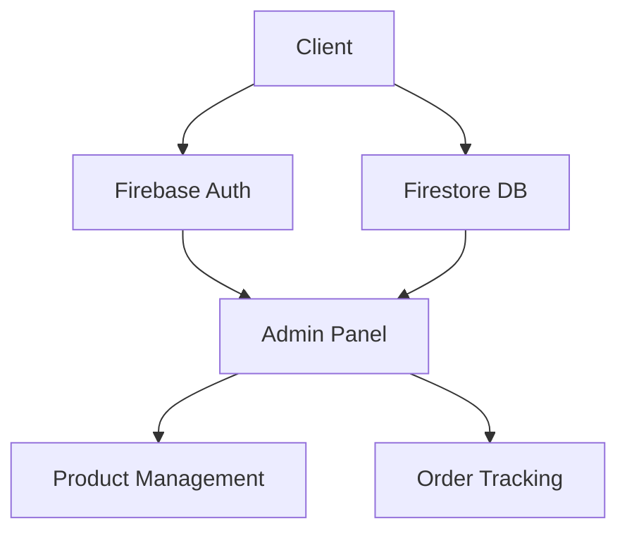
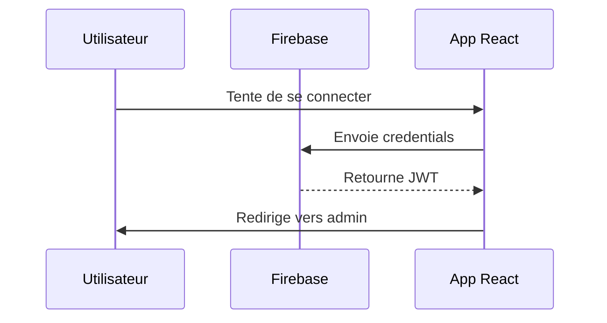
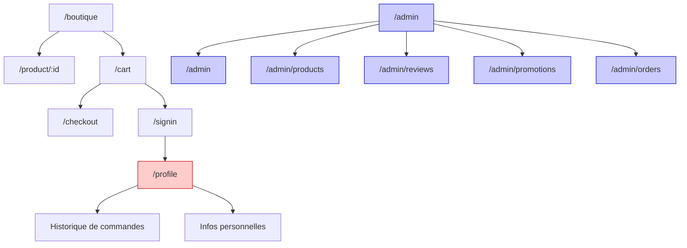

# Architecture Technique

## Schéma des Composants


## Workflow d'Authentification


## Flux de Navigation


## Architecture de l'Administration

### Structure des Composants
```
src/components/admin/
├── dashboard/
│   └── AdminDashboard.js
├── layout/
│   ├── AdminLayout.js
│   ├── AdminSidebar.js
│   └── AdminHeader.js
├── shop/
│   ├── ProductList.js
│   ├── ProductForm.js
│   ├── ReviewList.js
│   ├── PromotionList.js
│   ├── PromotionForm.js
│   └── PromotionsManagement.js
├── orders/
│   ├── OrderList.js
│   ├── OrderDetails.js
│   └── OrdersManagement.js
└── ui/
    ├── SearchInput.js
    ├── ActionButton.js
    ├── TabNav.js
    ├── Modal.js
    ├── StatCard.js
    └── AlertItem.js
```

### Composants UI Réutilisables

Nous avons développé plusieurs composants UI réutilisables pour l'interface d'administration :

- **SearchInput** : Champ de recherche stylisé avec icône
- **ActionButton** : Bouton d'action avec support pour icônes et différentes couleurs
- **TabNav** : Navigation par onglets pour switcher entre les sections
- **Modal** : Fenêtre modale configurable pour les formulaires et détails
- **StatCard** : Carte pour afficher des statistiques avec icône et pourcentage de variation
- **AlertItem** : Composant pour afficher différents types d'alertes (info, succès, avertissement, erreur)

### Fonctionnalités d'Administration

1. **Tableau de Bord**
   - Vue d'ensemble des statistiques de vente
   - Graphiques de performance
   - Alertes et notifications
   - Produits les plus vendus

2. **Gestion des Produits**
   - Liste des produits avec filtrage et recherche
   - Ajout, modification et suppression de produits
   - Gestion des catégories et du stock

3. **Gestion des Avis**
   - Modération des avis clients
   - Filtrage par étoiles et statut
   - Approbation ou rejet des avis

4. **Gestion des Promotions**
   - Création de codes promotionnels
   - Configuration des remises (pourcentage ou montant fixe)
   - Définition des dates de validité

5. **Gestion des Commandes**
   - Suivi du statut des commandes
   - Filtrage par statut (en attente, en traitement, expédiées, livrées, annulées)
   - Détails des commandes et des produits associés

### Sécurité et Authentification

L'accès à l'interface d'administration est protégé par :

- **AdminRoute** : Composant qui vérifie non seulement l'authentification mais aussi les droits d'administrateur
- **Supabase Auth** : Authentification sécurisée via Supabase
- **Contrôle de rôle** : Vérification des rôles utilisateur pour l'accès administrateur

### Design System

L'interface d'administration suit un design system cohérent :

- **Couleur primaire** : #FE5000 (orange) pour l'identité visuelle de la marque
- **Palette secondaire** : Bleu, vert, rouge et gris pour les indicateurs
- **Composants Tailwind** : Utilisation de Tailwind CSS pour un design responsive et cohérent
- **Iconographie** : Utilisation de React Icons (Fi) pour une bibliothèque d'icônes uniforme
