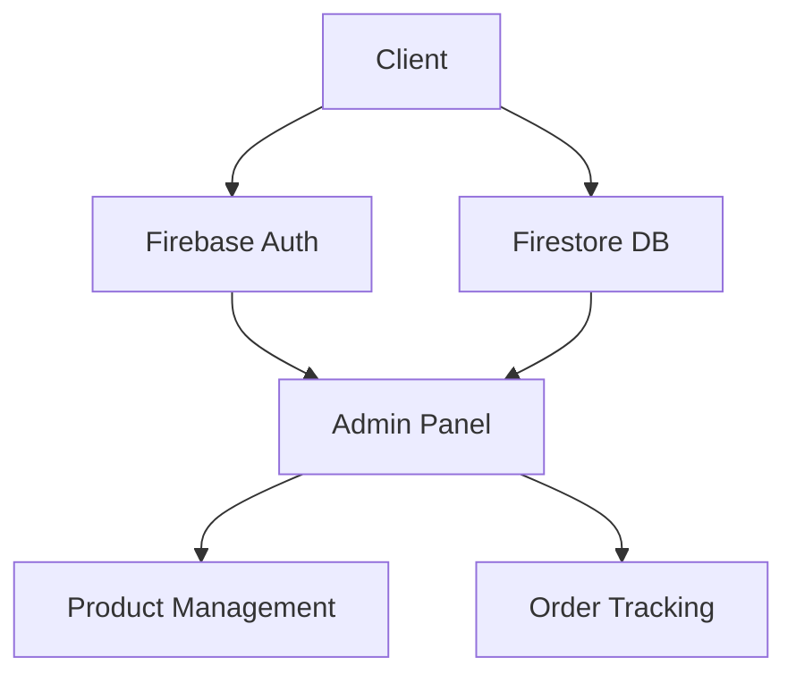
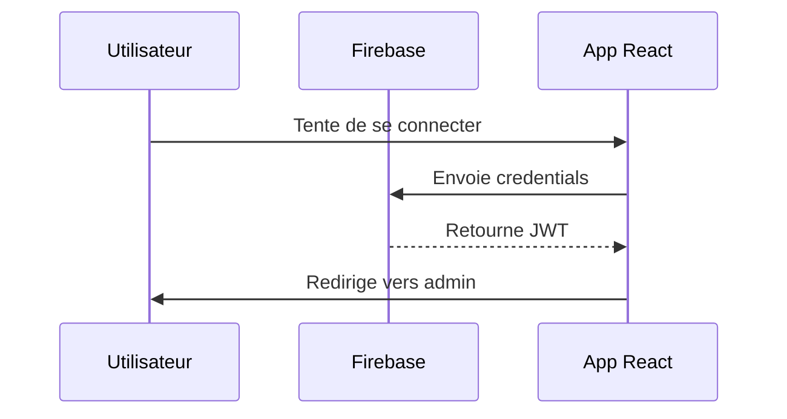
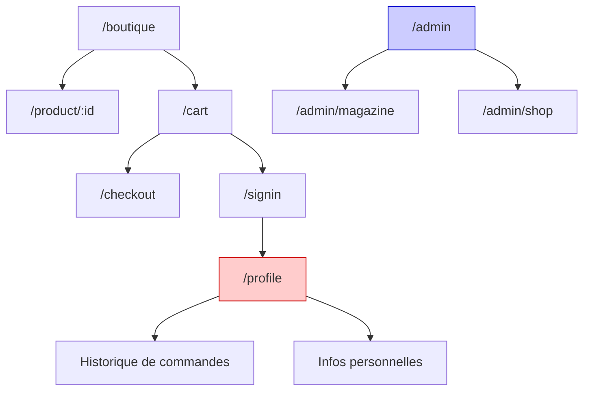

# Architecture Technique

## Schéma des Composants

```mermaid
graph TD
  A[Client] --> B[Firebase Auth]
  A --> C[Firestore DB]
  B --> D[Admin Panel]
  C --> D
  D --> E[Product Management]
  D --> F[Order Tracking]
```

## Workflow d'Authentification

```mermaid
sequenceDiagram
  participant U as Utilisateur
  participant F as Firebase
  participant A as App React
  U->>A: Tente de se connecter
  A->>F: Envoie credentials
  F-->>A: Retourne JWT
  A->>U: Redirige vers admin
```

## Flux de Navigation

```mermaid
flowchart TD
    Boutique["/boutique"] --> Produit["/product/:id"]
    Boutique --> Panier["/cart"]
    Panier --> Checkout["/checkout"]
    Panier --> Connexion["/signin"]
    Connexion --> Profil["/profile"]
    Profil --> Historique["Historique de commandes"]
    Profil --> InfosPerso["Infos personnelles"]
    Admin["/admin"] --> AdminMagazine["/admin/magazine"]
    Admin --> AdminShop["/admin/shop"]
    style Profil fill:#ffcccc,stroke:#cc0000
    style Admin fill:#ccccff,stroke:#0000cc
```
