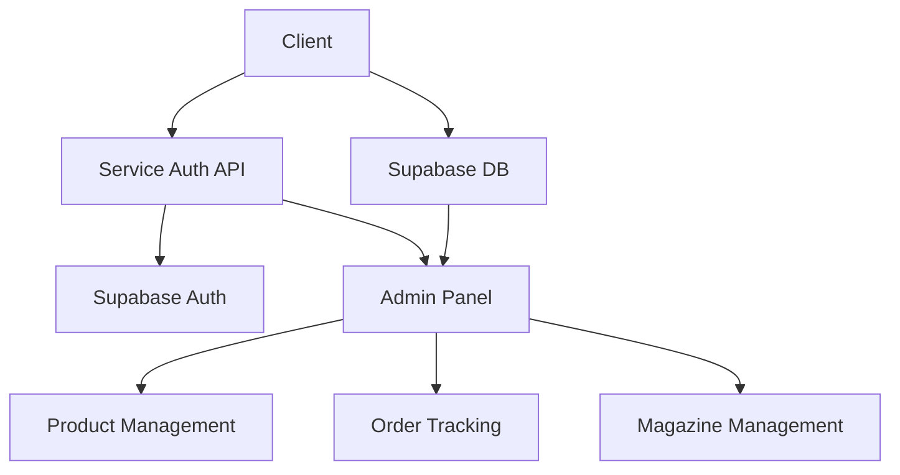
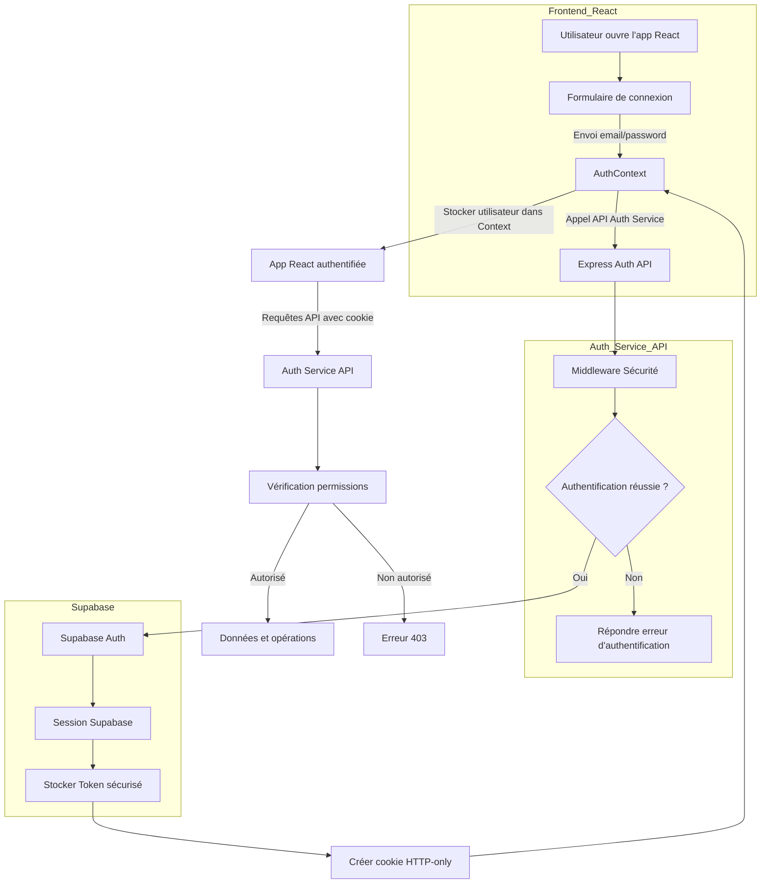
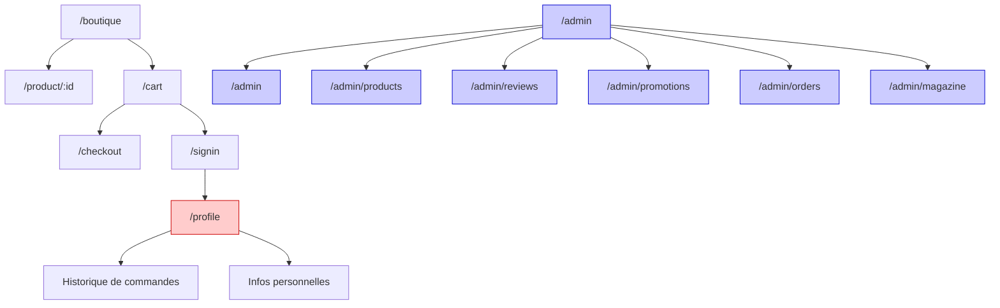
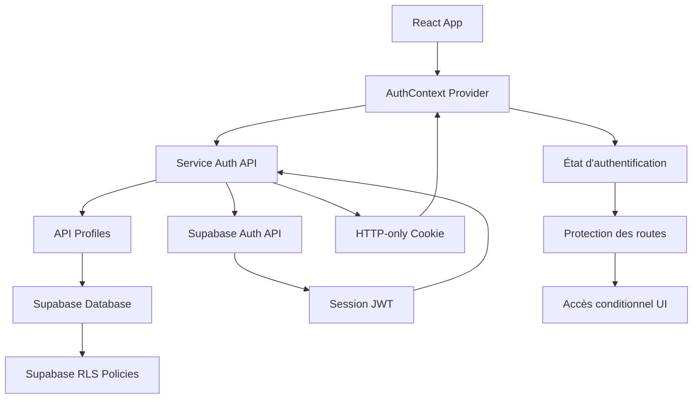

# Architecture Technique

## Schéma des Composants


## Workflow d'Authentification


## Flux de Navigation


## Système d'Authentification

### Architecture d'Authentification Sécurisée

L'application utilise une architecture d'authentification en trois couches :
1. **Frontend React** : Interface utilisateur et gestion de l'état d'authentification via Context API
2. **Service d'Authentification** : Service Express déployé sur Render qui sert d'intermédiaire sécurisé
3. **Supabase Auth** : Système d'authentification sous-jacent pour la gestion des utilisateurs



### Composants Clés de l'Authentification

#### 1. Service d'Authentification

Le service d'authentification est un serveur Express déployé sur Render qui sert d'intermédiaire entre le frontend et Supabase Auth :

```javascript
// Structure du service d'authentification
auth-service/
├── server.js              // Point d'entrée du serveur Express
├── middleware/            // Middleware de sécurité et d'authentification
├── controllers/           // Logique de contrôle des endpoints auth
├── config/                // Configuration Supabase
└── routes/                // Définition des routes d'API
```

Ce service :
- Intercepte les demandes d'authentification du frontend
- Communique avec Supabase Auth
- Stocke le JWT de session de manière sécurisée
- Émet des cookies HTTP-only pour le client
- Implémente des mesures de sécurité (rate limiting, CORS, etc.)

#### 2. Configuration Supabase

La connexion à Supabase est configurée dans le service d'authentification :
```javascript
const { createClient } = require('@supabase/supabase-js');

const supabase = createClient(
  process.env.SUPABASE_URL,
  process.env.SUPABASE_ANON_KEY
);
```

#### 3. AuthContext

Le contexte d'authentification (`src/contexts/AuthContext.js`) a été modifié pour interagir avec le service d'authentification au lieu de Supabase directement :

```javascript
// Méthodes clés dans AuthContext
const signIn = async (email, password) => {
  try {
    const response = await fetch(`${AUTH_API_URL}/auth/login`, {
      method: 'POST',
      headers: { 'Content-Type': 'application/json' },
      body: JSON.stringify({ email, password }),
      credentials: 'include' // Important pour le support des cookies
    });
    const data = await response.json();
    
    if (!response.ok) throw new Error(data.message || 'Erreur de connexion');
    
    setUser(data.user);
    setIsAuthenticated(true);
    return data.user;
  } catch (error) {
    setError(error.message);
    throw error;
  }
};

const checkUser = async () => {
  try {
    const response = await fetch(`${AUTH_API_URL}/auth/user`, {
      credentials: 'include' // Inclure le cookie d'authentification
    });
    
    if (!response.ok) {
      setUser(null);
      setIsAuthenticated(false);
      return null;
    }
    
    const data = await response.json();
    setUser(data.user);
    setIsAuthenticated(true);
    return data.user;
  } catch (error) {
    setUser(null);
    setIsAuthenticated(false);
    return null;
  }
};
```

#### 4. Gestion des Rôles et Autorisation

L'application distingue principalement deux rôles :
- **user** : Accès limité aux fonctionnalités de base
- **admin** : Accès complet à l'interface d'administration

Ces rôles sont vérifiés via le service d'authentification :

```javascript
// Exemple de vérification de rôle dans AuthContext
const isAdmin = () => {
  return user && user.user_metadata && user.user_metadata.role === 'admin';
};
```

### Bascule entre Interface Admin et Site Public

Un bouton flottant permet aux administrateurs de basculer entre l'interface d'administration et le site public :

```javascript
// Composant AdminToggleButton
const AdminToggleButton = () => {
  const { isAdmin } = useAuth();
  const location = useLocation();
  const navigate = useNavigate();
  
  // Afficher uniquement pour les admins
  if (!isAdmin()) return null;
  
  const isInAdminSection = location.pathname.startsWith('/admin');
  
  const handleToggle = () => {
    // Conserver la position relative dans chaque section
    if (isInAdminSection) {
      // Rediriger vers la page équivalente du site public
      const publicPath = mapAdminToPublicPath(location.pathname);
      navigate(publicPath);
    } else {
      // Rediriger vers la page équivalente de l'admin
      const adminPath = mapPublicToAdminPath(location.pathname);
      navigate(adminPath);
    }
  };
  
  return (
    <button 
      className="fixed bottom-6 right-6 p-3 bg-primary text-white rounded-full shadow-lg z-50"
      onClick={handleToggle}
    >
      {isInAdminSection ? <PublicIcon /> : <AdminIcon />}
    </button>
  );
};
```

### Avantages de cette Architecture

Cette architecture d'authentification offre plusieurs avantages :

- **Sécurité renforcée** : Les tokens JWT ne sont jamais exposés au client
- **Cookies HTTP-only** : Protection contre les attaques XSS
- **Séparation des responsabilités** : Le service d'authentification peut évoluer indépendamment
- **Contrôle granulaire** : Possibilité d'ajouter des mesures de sécurité supplémentaires
- **Évolutivité** : Le service peut être dimensionné indépendamment du reste de l'application

### Éléments de Sécurité Implémentés

- **AdminRoute** : Composant qui vérifie non seulement l'authentification mais aussi les droits d'administrateur
- **Rate Limiting** : Protection contre les attaques par force brute
- **CORS** : Configuration stricte pour limiter les origines autorisées
- **Helmet** : Configuration des en-têtes HTTP de sécurité
- **Cookie secure et HTTP-only** : Protection des tokens de session
- **Supabase RLS** : Règles de sécurité au niveau de la base de données

## Architecture de l'Administration

### Structure des Composants
```
src/components/admin/
├── dashboard/
│   └── AdminDashboard.js
├── layout/
│   ├── AdminLayout.js
│   ├── AdminSidebar.js
│   └── AdminHeader.js
├── shop/
│   ├── ProductList.js
│   ├── ProductForm.js
│   ├── ReviewList.js
│   ├── PromotionList.js
│   ├── PromotionForm.js
│   └── PromotionsManagement.js
├── magazine/
│   ├── ArticleList.js
│   ├── ArticleForm.js
│   └── ArticleManagement.js
├── orders/
│   ├── OrderList.js
│   ├── OrderDetails.js
│   └── OrdersManagement.js
└── ui/
    ├── SearchInput.js
    ├── ActionButton.js
    ├── TabNav.js
    ├── Modal.js
    ├── StatCard.js
    ├── AlertItem.js
    └── AdminPublicToggle.js
```

### Basculement Admin/Public

Un bouton flottant permettant aux administrateurs de basculer entre l'interface d'administration et le site public a été implémenté avec les caractéristiques suivantes :
- Visible uniquement pour les utilisateurs ayant des droits d'administrateur
- Positionné de manière cohérente sur toutes les pages
- Conserve la position/page dans chaque section lors des allers-retours
- Utilise une icône explicite pour une compréhension instantanée

Le composant `AdminPublicToggle.js` gère cette fonctionnalité et utilise le contexte d'authentification pour vérifier les droits d'accès.

### Composants UI Réutilisables

Nous avons développé plusieurs composants UI réutilisables pour l'interface d'administration :

- **SearchInput** : Champ de recherche stylisé avec icône
- **ActionButton** : Bouton d'action avec support pour icônes et différentes couleurs
- **TabNav** : Navigation par onglets pour switcher entre les sections
- **Modal** : Fenêtre modale configurable pour les formulaires et détails
- **StatCard** : Carte pour afficher des statistiques avec icône et pourcentage de variation
- **AlertItem** : Composant pour afficher différents types d'alertes (info, succès, avertissement, erreur)

### Fonctionnalités d'Administration

1. **Tableau de Bord**
   - Vue d'ensemble des statistiques de vente
   - Graphiques de performance
   - Alertes et notifications
   - Produits les plus vendus

2. **Gestion des Produits**
   - Liste des produits avec filtrage et recherche
   - Ajout, modification et suppression de produits
   - Gestion des catégories et du stock

3. **Gestion du Magazine**
   - Liste des articles avec filtrage et recherche
   - Création et édition d'articles
   - Association d'articles à des produits
   - Mise en avant d'articles sur la page d'accueil

4. **Gestion des Avis**
   - Modération des avis clients
   - Filtrage par étoiles et statut
   - Approbation ou rejet des avis

5. **Gestion des Promotions**
   - Création de codes promotionnels
   - Configuration des remises (pourcentage ou montant fixe)
   - Définition des dates de validité

6. **Gestion des Commandes**
   - Suivi du statut des commandes
   - Filtrage par statut (en attente, en traitement, expédiées, livrées, annulées)
   - Détails des commandes et des produits associés

### Sécurité et Authentification

L'accès à l'interface d'administration est protégé par :

- **AdminRoute** : Composant qui vérifie non seulement l'authentification mais aussi les droits d'administrateur
- **Supabase Auth** : Authentification sécurisée via Supabase
- **Contrôle de rôle** : Vérification des rôles utilisateur pour l'accès administrateur
- **AuthContext** : Contexte React qui gère l'état d'authentification et fournit l'utilisateur et ses rôles

### Design System

L'interface d'administration suit un design system cohérent :

- **Couleur primaire** : #FE5000 (orange) pour l'identité visuelle de la marque
- **Palette secondaire** : Bleu, vert, rouge et gris pour les indicateurs
- **Composants Tailwind** : Utilisation de Tailwind CSS pour un design responsive et cohérent
- **Iconographie** : Utilisation de React Icons (Fi) pour une bibliothèque d'icônes uniforme
