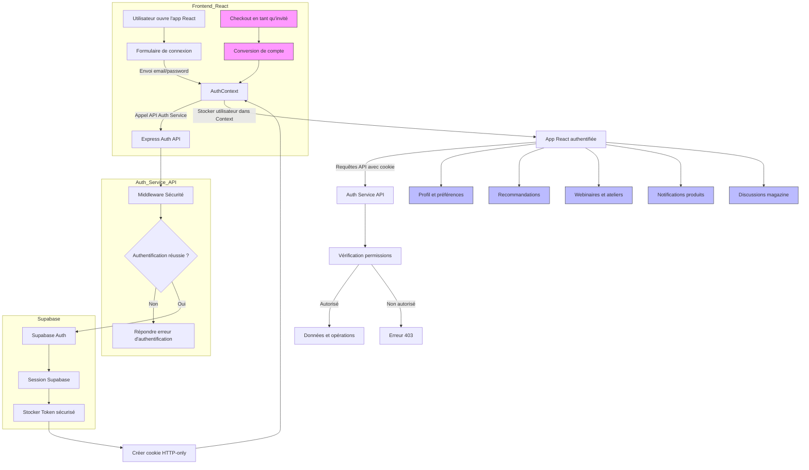
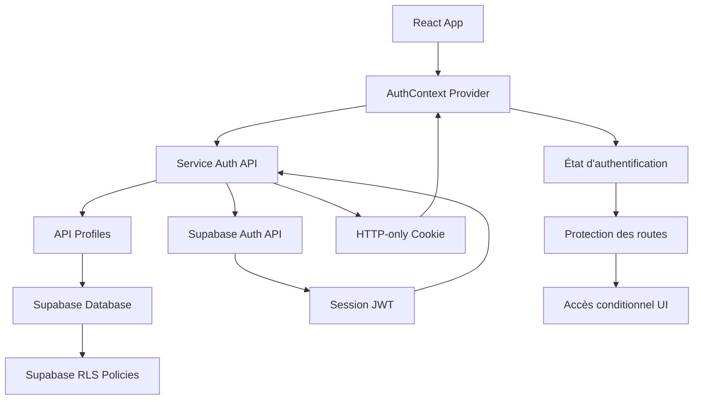
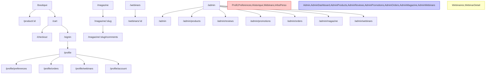

# Architecture Technique inHerbisVeritas

> **Note**: Ce document contient des diagrammes au format Mermaid. Pour les visualiser, vous pouvez copier-coller le code des diagrammes sur [Mermaid Live Editor](https://mermaid.live/) - un outil gratuit, open-source et sans inscription qui permet de visualiser les diagrammes Mermaid sans aucune limitation.

## Vue d'Ensemble

inHerbisVeritas est une application e-commerce React pour les produits naturels, combinant une boutique en ligne et un magazine éditorial. L'architecture suit une approche modulaire avec séparation claire des responsabilités.

## Organisation du Projet

```
src/
├── components/          # Composants réutilisables
│   ├── admin/           # Interface d'administration
│   ├── auth/            # Composants d'authentification
│   ├── layout/          # Éléments de structure (header, footer)
│   ├── magazine/        # Composants liés aux articles
│   ├── shop/            # Composants liés aux produits
│   ├── user/            # Composants du profil utilisateur
│   ├── webinars/        # Composants pour webinaires et ateliers
│   └── recommendations/ # Système de recommandations personnalisées
├── contexts/            # Contextes React (Auth, Panier, Préférences)
├── pages/               # Pages de l'application
├── services/
│   └── api/             # Services API et configuration Supabase
│       ├── articleService.js      # Service pour les articles
│       ├── productService.js      # Service pour les produits
│       ├── userService.js         # Service pour les utilisateurs
│       ├── webinarService.js      # Service pour les webinaires
│       ├── notificationService.js # Service pour les notifications
│       └── recommendationService.js # Service pour les recommandations
├── utils/               # Fonctions utilitaires
│   ├── caseConverters.js # Conversion snake_case/camelCase
│   └── userStoryEngine.js # Moteur d'analyse pour recommandations
└── App.js               # Point d'entrée de l'application
```

## Schéma des Composants

```mermaid
graph TD
    %% Acteurs principales
    Client([Client])
    Guest([Invité])
    User([Utilisateur Authentifié])
    
    %% Services d'authentification
    AuthAPI[Service Auth API]
    SupabaseAuth[Supabase Auth]
    
    %% Base de données
    SupabaseDB[(Supabase DB)]
    
    %% Fonctionnalités partagées
    PublicSite[Site Public]
    Shop[Boutique]
    Magazine[Magazine]
    Checkout[Processus d'achat]
    
    %% Fonctionnalités utilisateur authentifié
    UserProfile[Gestion de Profil]
    OrderTracking[Suivi des Commandes]
    LoyaltyProgram[Programme de Fidélité]
    UserPreferences[Préférences Utilisateur]
    RecommendationEngine[Moteur de Recommandations]
    WebinarSystem[Système de Webinaires]
    Workshops[Ateliers en ligne/IRL]
    ProductNotifications[Notifications Produits]
    MagazineDiscussions[Discussions Magazine]
    GuestConversion[Conversion Compte Invité]
    
    %% Administration
    AdminPanel[Panel Administration]
    ProductManagement[Gestion des Produits]
    OrderManagement[Gestion des Commandes]
    MagazineManagement[Gestion du Magazine]
    WebinarManagement[Gestion des Webinaires]
    
    %% Flux des utilisateurs
    Client --> Guest
    Client --> User
    Guest --> GuestConversion
    GuestConversion --> User
    
    %% Authentification
    Guest -- "S'authentifie" --> AuthAPI
    User -- "Session" --> AuthAPI
    AuthAPI --> SupabaseAuth
    
    %% Accès aux fonctionnalités publiques
    Guest --> PublicSite
    User --> PublicSite
    PublicSite --> Shop
    PublicSite --> Magazine
    Guest --> Checkout
    
    %% Accès aux fonctionnalités utilisateur
    User --> UserProfile
    User --> OrderTracking
    User --> LoyaltyProgram
    User --> UserPreferences
    User --> WebinarSystem
    WebinarSystem --> Workshops
    User --> MagazineDiscussions
    User --> ProductNotifications
    
    %% Système de recommandations
    UserPreferences --> RecommendationEngine
    OrderTracking --> RecommendationEngine
    RecommendationEngine --> Shop
    
    %% Interactions avec la base de données
    SupabaseDB --> PublicSite
    SupabaseDB <--> UserProfile
    SupabaseDB <--> OrderTracking
    SupabaseDB <--> LoyaltyProgram
    SupabaseDB <--> UserPreferences
    SupabaseDB <--> RecommendationEngine
    SupabaseDB <--> WebinarSystem
    SupabaseDB <--> Workshops
    SupabaseDB <--> ProductNotifications
    SupabaseDB <--> MagazineDiscussions
    
    %% Administration
    AuthAPI --> AdminPanel
    SupabaseDB <--> AdminPanel
    AdminPanel --> ProductManagement
    AdminPanel --> OrderManagement
    AdminPanel --> MagazineManagement
    AdminPanel --> WebinarManagement
    
    %% Styles
    classDef public fill:#dfd,stroke:#4a4
    classDef authenticated fill:#ddf,stroke:#44b
    classDef admin fill:#fdd,stroke:#b44
    
    class Guest,PublicSite,Shop,Magazine,Checkout public
    class User,UserProfile,OrderTracking,LoyaltyProgram,UserPreferences,RecommendationEngine,WebinarSystem,Workshops,ProductNotifications,MagazineDiscussions,GuestConversion authenticated
    class AdminPanel,ProductManagement,OrderManagement,MagazineManagement,WebinarManagement admin
```



## Architecture Frontend

### Composants Principaux

- **Layout** : Structure de base de toutes les pages
- **AdminLayout** : Structure spécifique pour le panel d'administration
- **UserProfile** : Gestion du profil utilisateur et préférences
- **RecommendationSection** : Affichage des produits recommandés
- **WebinarList/WebinarDetail** : Consultation et inscription aux webinaires
- **ProductNotificationToggle** : Gestion des alertes de disponibilité
- **MagazineComments** : Système de commentaires pour les articles
- **GuestCheckoutToAccount** : Conversion de compte invité

### Gestion de l'État

L'application utilise plusieurs méthodes de gestion d'état :

1. **Contexte React** : Pour l'état global (authentication, panier, préférences)
   ```javascript
   // Exemple d'utilisation du contexte d'authentification et préférences
   const { user, isAuthenticated, signIn, signOut } = useAuth();
   const { preferences, updatePreferences } = useUserPreferences();
   ```

2. **État local** : Pour les composants individuels avec `useState` et `useEffect`
   ```javascript
   const [webinars, setWebinars] = useState([]);
   const [loading, setLoading] = useState(true);
   
   useEffect(() => {
     const fetchWebinars = async () => {
       setLoading(true);
       const { data, error } = await webinarService.getUpcomingWebinars();
       if (!error) setWebinars(data);
       setLoading(false);
     };
     
     fetchWebinars();
   }, []);
   ```

## Architecture Backend (Supabase)

### Structure de la Base de Données

La base de données Supabase est organisée en tables suivant la convention snake_case pour les noms de colonnes.

#### Nouvelles Tables

1. **users_preferences** : Stocke les préférences utilisateur (type de peau, allergies, parfums préférés)
2. **users_stories** : Agrégation des données pour le système de recommandation personnalisée
3. **product_notifications** : Alertes de disponibilité pour les produits
4. **webinars** : Informations sur les webinaires et ateliers
5. **webinar_participants** : Liaison entre webinaires et participants, incluant la fonctionnalité de cadeau

#### Relations Clés

- **users** ↔ **users_preferences** : One-to-one, stockage des préférences utilisateur
- **users** ↔ **users_stories** : One-to-many, chaque utilisateur peut avoir plusieurs "parcours"
- **users_stories** ↔ **products** : Many-to-many via les champs `products_viewed` et `products_purchased`
- **users** ↔ **product_notifications** : Many-to-many, un utilisateur peut suivre plusieurs produits
- **users** ↔ **webinar_participants** : Many-to-many, participation à plusieurs webinaires
- **webinar_participants** ↔ **users** : Many-to-many via `gifted_to_user_id` pour les cadeaux d'atelier

## Services API

### Nouveaux Services

```javascript
// services/api/userPreferencesService.js
import { supabase } from './supabaseClient';
import { toSnakeCase, toCamelCase } from '../../utils/caseConverters';

const userPreferencesService = {
  async getUserPreferences(userId) {
    try {
      const { data, error } = await supabase
        .from('users_preferences')
        .select('*')
        .eq('user_id', userId)
        .single();
      
      if (error) throw error;
      
      return { data: toCamelCase(data), error: null };
    } catch (error) {
      return { data: null, error };
    }
  },
  
  async updateUserPreferences(userId, preferencesData) {
    try {
      const snakeCaseData = toSnakeCase(preferencesData);
      
      // Vérifier si les préférences existent déjà
      const { data: existingData } = await supabase
        .from('users_preferences')
        .select('id')
        .eq('user_id', userId)
        .single();
      
      let result;
      
      if (existingData) {
        // Mise à jour des préférences existantes
        const { data, error } = await supabase
          .from('users_preferences')
          .update(snakeCaseData)
          .eq('user_id', userId)
          .select();
        
        result = { data, error };
      } else {
        // Création de nouvelles préférences
        const { data, error } = await supabase
          .from('users_preferences')
          .insert({
            ...snakeCaseData,
            user_id: userId
          })
          .select();
        
        result = { data, error };
      }
      
      if (result.error) throw result.error;
      
      return { data: toCamelCase(result.data[0]), error: null };
    } catch (error) {
      return { data: null, error };
    }
  }
};

export default userPreferencesService;
```

```javascript
// services/api/webinarService.js
import { supabase } from './supabaseClient';
import { toSnakeCase, toCamelCase } from '../../utils/caseConverters';

const webinarService = {
  async getUpcomingWebinars() {
    try {
      const now = new Date().toISOString();
      
      const { data, error } = await supabase
        .from('webinars')
        .select('*')
        .gte('date', now)
        .order('date', { ascending: true });
      
      if (error) throw error;
      
      return { data: data.map(webinar => toCamelCase(webinar)), error: null };
    } catch (error) {
      return { data: null, error };
    }
  },
  
  async registerForWebinar(webinarId, userId, giftedToUserId = null) {
    try {
      const { data, error } = await supabase
        .from('webinar_participants')
        .insert({
          webinar_id: webinarId,
          user_id: userId,
          registration_date: new Date().toISOString(),
          gifted_to_user_id: giftedToUserId
        })
        .select();
      
      if (error) throw error;
      
      return { data: toCamelCase(data[0]), error: null };
    } catch (error) {
      return { data: null, error };
    }
  }
};

export default webinarService;
```

```javascript
// services/api/notificationService.js
import { supabase } from './supabaseClient';
import { toSnakeCase, toCamelCase } from '../../utils/caseConverters';

const notificationService = {
  async subscribeToProductAvailability(userId, productId) {
    try {
      // Vérifier si déjà abonné
      const { data: existingData } = await supabase
        .from('product_notifications')
        .select('id')
        .eq('user_id', userId)
        .eq('product_id', productId)
        .single();
      
      if (existingData) {
        return { data: toCamelCase(existingData), error: null };
      }
      
      const { data, error } = await supabase
        .from('product_notifications')
        .insert({
          user_id: userId,
          product_id: productId,
          created_at: new Date().toISOString(),
          notified: false
        })
        .select();
      
      if (error) throw error;
      
      return { data: toCamelCase(data[0]), error: null };
    } catch (error) {
      return { data: null, error };
    }
  },
  
  async unsubscribeFromProductAvailability(userId, productId) {
    try {
      const { error } = await supabase
        .from('product_notifications')
        .delete()
        .eq('user_id', userId)
        .eq('product_id', productId);
      
      if (error) throw error;
      
      return { error: null };
    } catch (error) {
      return { error };
    }
  }
};

export default notificationService;
```

```javascript
// services/api/recommendationService.js
import { supabase } from './supabaseClient';
import { toSnakeCase, toCamelCase } from '../../utils/caseConverters';

const recommendationService = {
  async getPersonalizedRecommendations(userId) {
    try {
      // 1. Récupérer les préférences utilisateur
      const { data: userPreferences } = await supabase
        .from('users_preferences')
        .select('*')
        .eq('user_id', userId)
        .single();
      
      // 2. Récupérer les "stories" actives de l'utilisateur
      const { data: userStories } = await supabase
        .from('users_stories')
        .select('*')
        .eq('user_id', userId)
        .eq('active', true);
      
      // 3. Extraire les tags de recommandation
      let recommendationTags = [];
      
      if (userPreferences) {
        if (userPreferences.skin_type) recommendationTags.push(userPreferences.skin_type);
        if (userPreferences.preferred_scents) recommendationTags = [...recommendationTags, ...userPreferences.preferred_scents];
      }
      
      if (userStories && userStories.length > 0) {
        userStories.forEach(story => {
          if (story.recommendation_tags) {
            recommendationTags = [...recommendationTags, ...story.recommendation_tags];
          }
        });
      }
      
      // 4. Récupérer les produits correspondants aux tags
      let query = supabase
        .from('products')
        .select('*')
        .eq('available', true);
      
      if (recommendationTags.length > 0) {
        query = query.contains('tags', recommendationTags);
      }
      
      const { data: products, error } = await query.limit(10);
      
      if (error) throw error;
      
      return { data: products.map(product => toCamelCase(product)), error: null };
    } catch (error) {
      return { data: null, error };
    }
  }
};

export default recommendationService;
```

## Moteur de Recommandations Personnalisées

Le moteur de recommandations utilise la table `users_stories` qui agrège intelligemment les données utilisateur.

### Concept de "User Stories"

Les "user stories" représentent différents aspects du parcours d'un utilisateur :

1. **Problèmes spécifiques** : Conditions de peau, allergies, sensibilités
2. **Objectifs** : Ce que l'utilisateur souhaite accomplir avec les produits naturels
3. **Style de vie** : Préférences générales, habitudes d'achat

### Structure du Moteur

```javascript
// utils/userStoryEngine.js

export const analyzeUserBehavior = (userData, orderHistory, viewedProducts) => {
  const stories = [];
  
  // Détecter les problèmes spécifiques
  if (userData?.preferences?.concerns?.length > 0) {
    stories.push({
      storyType: 'problem',
      storyContent: {
        problems: userData.preferences.concerns,
        severity: estimateSeverity(orderHistory, userData.preferences.concerns)
      },
      recommendationTags: generateTagsFromConcerns(userData.preferences.concerns)
    });
  }
  
  // Détecter les objectifs
  const objectives = detectObjectives(orderHistory, viewedProducts);
  if (objectives.length > 0) {
    stories.push({
      storyType: 'objective',
      storyContent: {
        objectives,
        progress: calculateProgress(objectives, orderHistory)
      },
      recommendationTags: objectives.map(obj => obj.relatedTags).flat()
    });
  }
  
  // Analyser le style de vie
  const lifestyle = analyzeLifestyle(orderHistory, userData.preferences);
  stories.push({
    storyType: 'lifestyle',
    storyContent: lifestyle,
    recommendationTags: generateLifestyleTags(lifestyle)
  });
  
  return stories;
};

// Fonctions auxiliaires
const estimateSeverity = (orderHistory, concerns) => {
  // Logique pour estimer la sévérité des problèmes
};

const detectObjectives = (orderHistory, viewedProducts) => {
  // Logique pour détecter les objectifs de l'utilisateur
};

const calculateProgress = (objectives, orderHistory) => {
  // Logique pour calculer le progrès vers les objectifs
};

const analyzeLifestyle = (orderHistory, preferences) => {
  // Logique pour analyser le style de vie
};

const generateTagsFromConcerns = (concerns) => {
  // Logique pour générer des tags de recommandation
};

const generateLifestyleTags = (lifestyle) => {
  // Logique pour générer des tags de style de vie
};
```

## Conversion de Compte Invité

Le processus de conversion de compte invité vers un compte permanent se déroule en plusieurs étapes :

1. **Enregistrement de l'email** : L'utilisateur fournit un email lors du checkout en tant qu'invité
2. **Conservation des données** : Les informations de commande et préférences sont temporairement stockées
3. **Invitation à créer un compte** : Email avec lien magique envoyé après la commande
4. **Conversion fluide** : Les données temporaires sont associées au nouveau compte lors de la création

```javascript
// services/api/guestConversionService.js
import { supabase } from './supabaseClient';
import { toSnakeCase, toCamelCase } from '../../utils/caseConverters';

const guestConversionService = {
  async createTemporaryProfile(guestData, orderData) {
    // Stockage temporaire des données de profil invité
  },
  
  async sendAccountCreationInvitation(email, temporaryProfileId) {
    // Envoi d'email avec lien magique pour création de compte
  },
  
  async convertGuestToUser(temporaryProfileId, newUserId) {
    // Conversion des données temporaires en compte permanent
  }
};

export default guestConversionService;
```

## Workflow d'Authentification



## Structure du Système d'Authentification



## Rôles et Permissions

Le système définit plusieurs rôles pour les utilisateurs :

| Rôle | Description | Permissions |
|------|-------------|-------------|
| **anonymous** | Utilisateur non connecté | Lecture seule sur contenu public |
| **client** | Utilisateur standard | Lecture du contenu public, gestion de son profil, préférences, webinaires, commandes, avis |
| **admin** | Administrateur | Accès complet CRUD sur toutes les ressources |

## Flux de Navigation



## Stratégies d'Optimisation

### SEO et Accessibilité

- Structure de page claire avec balisage HTML sémantique
- URLs optimisées via le champ `slug` pour les articles
- Contenu riche en mots-clés pertinents

### Performance

- Utilisation de React pour l'interface utilisateur
- Styling avec Tailwind CSS pour minimiser la taille CSS
- Optimisation des images avec scripts automatisés
- Requêtes Supabase optimisées avec filtres appropriés

### Expérience Utilisateur

- Navigation intuitive et accessible
- Interface responsive pour tous les appareils
- États de chargement clairs pour les opérations asynchrones
- Gestion d'erreurs conviviale avec messages explicatifs
- Conversion fluide entre expérience invité et compte permanent

## Conclusion

Cette architecture permet un développement modulaire et évolutif tout en offrant une expérience utilisateur optimisée et des performances solides. Les services API centralisés assurent une communication cohérente avec Supabase, tandis que les composants React modulaires facilitent la maintenance et l'extension de l'interface utilisateur. L'ajout des nouvelles fonctionnalités utilisateur (recommandations personnalisées, webinaires, préférences, notifications, discussions magazine, conversion de compte) renforce l'engagement des utilisateurs et optimise l'expérience d'achat.
