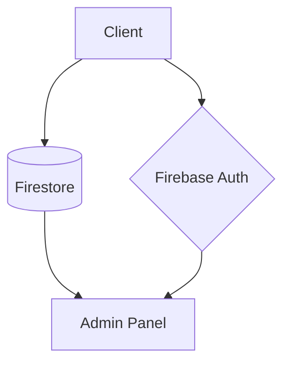

# In Herbis Veritas - Site e-commerce

## Authentification

L'application utilise **Firebase Authentication** avec 2 fournisseurs :

- Connexion Google
- Connexion Facebook

### Configuration requise

1. Ajouter vos identifiants Firebase dans `config/firebaseConfig.js`
2. Activer les providers dans la [console Firebase](https://console.firebase.google.com)
3. Déployer les règles de sécurité Firestore si nécessaire

## Démarrage

```bash
npm install
npm start
```

## Architecture Technique

### Structure des Fichiers Clés

| Fichier | Rôle | Technologies |
|---------|------|--------------|
| `src/config/firebaseConfig.js` | Configuration Firebase | Environnement variables |
| `src/contexts/AuthContext.js` | Gestion état d'authentification | React Context API |
| `src/components/ProtectedRoute.js` | Protection des routes | React Router 6 |

### Dépendances Principales

```json
{
  "firebase": "Authentification temps réel",
  "react-router-dom": "Gestion des routes",
  "tailwindcss": "Stylage moderne"
}
```

### Diagramme d'Architecture


