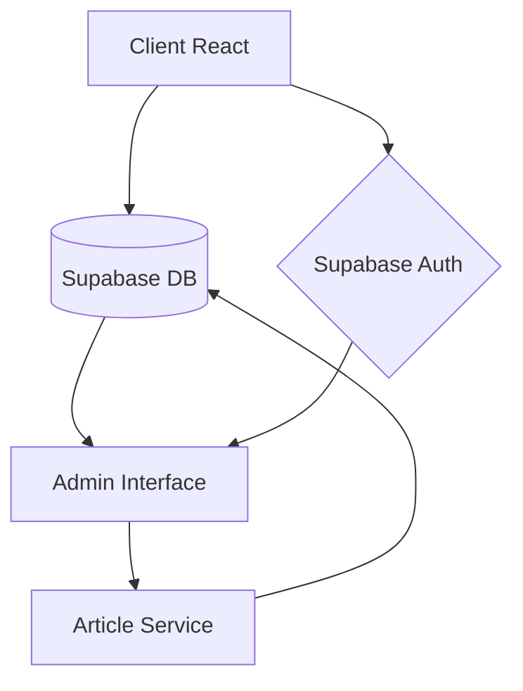

# In Herbis Veritas - Plateforme Herboriste et Magazine

## Guide pour Utilisateurs Non-Techniques

### Présentation du Projet
In Herbis Veritas est une plateforme dédiée aux produits à base de plantes et d'herbes médicinales, comprenant à la fois une boutique en ligne et un magazine spécialisé. Ce projet vise à offrir une expérience utilisateur fluide et intuitive pour la découverte, l'achat de produits naturels et l'accès à des connaissances sur les plantes médicinales.

### Fonctionnalités Principales
- **Boutique en ligne** : Catalogue de produits naturels et herboristerie
- **Magazine** : Articles thématiques sur les plantes, recettes et bien-être
- **Administration** : Interface simplifiée pour gérer les produits et articles
- **Authentification** : Connexion sécurisée pour les administrateurs et utilisateurs

### Accès à l'Administration
Pour accéder à l'interface d'administration :
1. Connectez-vous avec vos identifiants
2. Accédez au tableau de bord via le menu principal
3. Utilisez les outils de gestion d'articles et de produits

### Gestion des Articles du Magazine
La nouvelle interface d'administration permet :
- Création d'articles avec éditeur simplifié
- Attribution de catégories et produits associés
- Mise en avant d'articles sur la page d'accueil
- Filtrage et recherche dans la liste des articles

## Guide pour Développeurs

### Stack Technique
- **Frontend** : React (v18+)
- **Styles** : Tailwind CSS
- **Routage** : React Router v6
- **Authentification** : Intégration Supabase (transition depuis Firebase)
- **Base de données** : Supabase (PostgreSQL)
- **État** : React Context API et useState/useEffect

### Architecture du Projet
```
src/
├── components/          # Composants réutilisables
│   ├── admin/           # Interface d'administration
│   ├── auth/            # Composants d'authentification
│   ├── layout/          # Éléments de mise en page
│   └── magazine/        # Composants spécifiques au magazine
├── contexts/            # Contextes React (Auth, Panier, etc.)
├── data/                # Données mockées pour le développement
├── pages/               # Pages principales de l'application
├── services/            # Couche service pour l'accès aux données
│   └── api/             # Services API et configuration
├── styles/              # Styles globaux et utilitaires CSS
└── utils/               # Fonctions utilitaires
```

### Couche Service et Gestion des Données
Le projet utilise une architecture en couches avec une séparation claire entre :
- **Composants UI** : Responsables de l'affichage
- **Services** : Gestion de l'accès aux données et logique métier
- **Contextes** : Partage d'état global

#### Service d'Articles
Le service d'articles (`articleService.js`) fournit une interface unifiée pour gérer les articles du magazine :

```javascript
// Exemples d'utilisation
import articleService from '../services/api/articleService';

// Récupérer tous les articles
const { data, count, error } = await articleService.getArticles({ 
  category: 'Plantes médicinales',
  search: 'camomille',
  page: 1,
  limit: 10 
});

// Créer un article
const { data, error } = await articleService.createArticle({
  title: 'Nouveau titre',
  category: 'Bien-être',
  excerpt: 'Description courte...',
  content: 'Contenu complet...',
  featured: false
});
```

#### Mode Développement vs Production
Le service supporte deux modes de fonctionnement :
- **Mode développement** (`useMockData = true`) : Utilise des données mockées
- **Mode production** (`useMockData = false`) : Utilise Supabase comme backend

Cette approche permet de développer sans dépendre d'un backend et facilite la transition vers la production.

### Authentification

L'application utilise **Supabase Auth** (transition depuis Firebase) avec :

- Connexion par email/mot de passe
- Connexion Google
- Connexion Facebook

#### Configuration de l'authentification

1. Ajouter vos identifiants Supabase dans `src/config/supabase.js`
2. Le contexte d'authentification est défini dans `AuthContext.js`
3. La déconnexion se fait via la méthode `logout()` du contexte

```javascript
// Exemple d'utilisation du contexte d'authentification
import { useAuth } from '../contexts/AuthContext';

function MonComposant() {
  const { user, logout, isAdmin } = useAuth();
  
  return (
    <div>
      {user ? (
        <>
          <p>Connecté en tant que {user.email}</p>
          <button onClick={logout}>Déconnexion</button>
          {isAdmin && <p>Vous avez des privilèges administrateur</p>}
        </>
      ) : (
        <p>Non connecté</p>
      )}
    </div>
  );
}
```

### Démarrage du Projet

#### Installation
```bash
npm install
```

#### Développement
```bash
npm start
```

#### Déploiement
```bash
npm run build
```

### Migration vers la Production
Pour passer du mode développement au mode production :

1. Configurez votre base de données Supabase
2. Modifiez la valeur de `useMockData` à `false` dans les services API
3. Assurez-vous que tous les champs requis sont correctement mappés
4. Migrez les données de test vers Supabase si nécessaire

## Contributions et Maintenance

### Bonnes Pratiques
- Utiliser la couche service pour toutes les opérations de données
- Respecter la séparation des responsabilités
- Documenter tout nouveau composant ou service
- Maintenir la compatibilité avec les données existantes

### Structure des Données des Articles
Voici la structure complète d'un article :
```javascript
{
  id: 1,                         // Identifiant unique
  title: "Titre de l'article",   // Titre
  slug: "titre-de-l-article",    // Slug pour l'URL
  category: "Catégorie",         // Catégorie
  excerpt: "Résumé court...",    // Extrait affiché dans les listes
  content: "Contenu complet...", // Contenu formaté
  imageUrl: "/chemin/image.jpg", // Image principale
  featured: false,               // Mis en avant sur la page d'accueil
  date: "10 mars 2025",          // Date formatée
  readTime: "5 min",             // Temps de lecture estimé
  relatedProductId: 123          // Produit associé (optionnel)
}
```

### Diagramme d'Architecture


